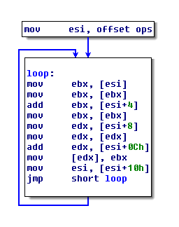
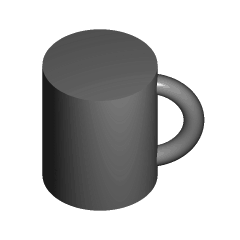
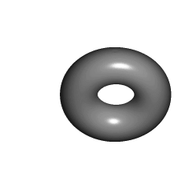

## _reductio_ [ad absurdum]

an exploration of code homeomorphism  
: all programs can be reduced to the same instruction stream.

github.com/xoreaxeaxeax/reductio // domas // @xoreaxeaxeax

 AES                                  | Minesweeper
:------------------------------------:|:------------------------------------:
      | 


## Concept

In the mathematical field of topology, two topological spaces are said to be
*homeomorphic* if (roughly speaking) one can be transformed into the other
through continuous deformation:


Equivalently, two spaces are homeomorphic when both can be reduced to an
identical, topologically equivalent space:

 

_reductio_ imagines a similar concept for computer code: performing a series of
transformations on entirely different programs, to induce an equivalence in
instruction streams.


## Overview

r.a.a. reduces all C programs to identical instruction streams; that is, the
instructions executed by the processor become the same for every program.  The
demonstration uses C and x86, but is not unique to either of these - the concept
is easily adapted to most languages and architectures.


## Usage

```
python reductio.py example.c
```


## Examples

The basic effects of the process can be seen in [examples](examples/), which
contains the reduced versions of two programs: AES and Minesweeper.  The
disassembly of each is shown below.

 AES                                  | Minesweeper
:------------------------------------:|:------------------------------------:
      | 

The instructions execute in a continuous loop, and are the same for every
program.  The final jmp performs the loop, and, when necessary, branches to
shared libraries; for example, if a program calls 'malloc', malloc is executed
through the jmp.  This is only necessary when programs are linked to non-reduced
code; if all code is run through the reduction, the dynamic jmp can be replace
with a constant loop back to the beginning of the program.


## Notes

* r.a.a. reduces all code to the same instruction stream.  Note that this is
  distinct from, for example, an emulator, wherein a single set of
  instructions can run multiple programs, but the sequence of instructions
  differs depending on what program is being emulated.  In r.a.a., rather, a
  processor performs the exact same steps for every program, yet from this is
  able to produce any possible result.

* r.a.a. allows you to link to other, non-reduced code; for example, you
  can link to the standard C libraries without recompiling them.  Naturally,
  if you do this, the instruction streams will diverge in the non-reduced
  libraries.

* The reduction may be limited by the constraints of the OS - for example, if
  the only provided way to perform I/O is a syscall, the instruction stream
  must diverge at the syscall.  However, assuming the OS provides sufficient
  MMIO capabilities, the reduction premise holds.

* r.a.a. leverages the M/o/Vfuscator compiler as a first pass, to simplify the
  set of instructions we must work with.  To install the M/o/Vfuscator,

  ```
  git clone https://github.com/xoreaxeaxeax/movfuscator
  cd movfuscator
  ./build.sh
  sudo ./install.sh
  ```

* The reduction may consume significant amounts of memory.  Ensure you have an
  adequate swap file in place to prevent crashes during the reduction process.
